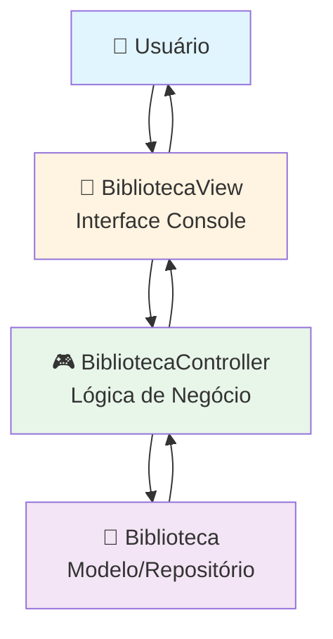
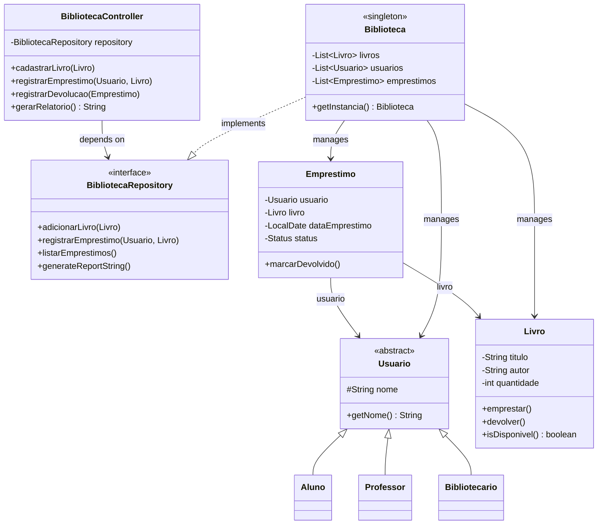
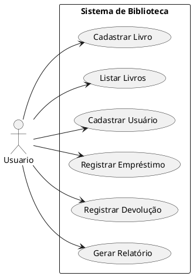

<div align="center">

# 📚 Sistema de Gerenciamento de Biblioteca

[](https://www.oracle.com/java/)
[](https://maven.apache.org/)
[](https://junit.org/junit5/)
[](target/site/jacoco/index.html)
[](LICENSE)

**Sistema acadêmico de gerenciamento de biblioteca com arquitetura MVC, design patterns e testes automatizados**

[Sobre o Projeto](#-sobre-o-projeto) • [Funcionalidades](#-funcionalidades) • [Tecnologias](#️-tecnologias) • [Arquitetura](#️-arquitetura) • [Instalação](#-instalação-e-execução) • [Como Usar](#-como-usar) • [Testes](#-testes) • [Documentação](#-documentação)

---

</div>

## 🎯 Sobre o Projeto

Sistema completo de gerenciamento de biblioteca desenvolvido como projeto acadêmico da **FATEC**, demonstrando aplicação prática de conceitos avançados de Engenharia de Software e boas práticas de desenvolvimento.

### 🎨 **Princípios e Padrões Aplicados**

<table>
<tr>
<td width="40%">

**🏗️ Arquitetura**
- ✅ Padrão **MVC** (Model-View-Controller)
- ✅ **SOLID Principles**
- ✅ **Clean Code**
- ✅ **Separation of Concerns**

</td>
<td width="35%">

**🎨 Design Patterns**
- ✅ **Singleton** (Biblioteca)
- ✅ **Factory** (Livro/Usuario)
- ✅ **Repository** (Interface)
- ✅ **Dependency Injection**

</td>
<td width="25%">

**🧪 Qualidade**
- ✅ **Testes Unitários**
- ✅ **Code Coverage**
- ✅ **Build Automation**
- ✅ **Documentação**

</td>
</tr>
</table>

O sistema gerencia **livros**, **usuários** (alunos, professores e bibliotecários) e **empréstimos** através de uma interface de console interativa, demonstrando fluxo completo de operações de uma biblioteca acadêmica.

---

## ✨ Funcionalidades

### 📚 **Core Features**

<table>
<tr>
<td width="50%">

**📖 Gerenciamento de Livros**
- Cadastrar livros com título e autor
- Listar acervo completo
- Controle automático de quantidade
- Verificação de disponibilidade
- Sistema de empréstimo/devolução

**👥 Gerenciamento de Usuários**
- Três tipos: **Alunos**, **Professores**, **Bibliotecários**
- Cadastro com validação de tipos
- Listagem de usuários por categoria
- Histórico de empréstimos por usuário

</td>
<td width="50%">

**📚 Sistema de Empréstimos**
- Registrar empréstimos com data automática
- Processar devoluções
- Status de acompanhamento (EMPRESTADO/DEVOLVIDO)
- Validação de disponibilidade
- Controle de inventário em tempo real

**📊 Relatórios Gerenciais**
- Relatório completo da biblioteca
- Empréstimos ativos por usuário
- Histórico completo de transações
- Status atual do acervo

</td>
</tr>
</table>

---

## 🛠️ Tecnologias

<div align="center">

<table>
  <tr>
    <td align="center" width="120">
      
      <br><b>Java 17</b>
      <br><sub>Linguagem Principal</sub>
    </td>
    <td align="center" width="120">
      
      <br><b>Maven</b>
      <br><sub>Build & Dependencies</sub>
    </td>
    <td align="center" width="120">
      
      <br><b>JUnit 5</b>
      <br><sub>Framework de Testes</sub>
    </td>
    <td align="center" width="120">
      
      <br><b>JaCoCo</b>
      <br><sub>Code Coverage</sub>
    </td>
  </tr>
</table>

</div>

### 📦 Stack Técnico

| Componente | Tecnologia | Versão | Função |
|------------|------------|--------|---------|
| **Runtime** | Java JDK | 17+ | Plataforma de execução |
| **Build Tool** | Apache Maven | 3.x | Gerenciamento de dependências e build |
| **Testing** | JUnit Jupiter | 5.10.0 | Framework de testes unitários |
| **Coverage** | JaCoCo Plugin | 0.8.10 | Análise de cobertura de código |
| **Documentation** | PlantUML | Latest | Diagramas UML e arquitetura |

---

## 🏗️ Arquitetura

### 📐 Padrão MVC (Model-View-Controller)

O sistema segue rigorosamente o padrão MVC, promovendo separação de responsabilidades:



### 🎨 Design Patterns Implementados

| Pattern | Implementação | Objetivo | Benefício Arquitetural |
|---------|---------------|----------|------------------------|
| **🔷 Singleton** | `Biblioteca.getInstancia()` | Instância única de repositório | Controle centralizado de estado |
| **🏭 Factory** | `LivroFactory`, `UsuarioFactory` | Criação padronizada de objetos | Encapsulamento da lógica de criação |
| **📦 Repository** | `BibliotecaRepository` (Interface) | Abstração de persistência | Desacoplamento e testabilidade |
| **💉 Dependency Injection** | Constructor Injection no Controller | Inversão de dependências (DIP) | Flexibilidade e manutenibilidade |

### 📁 Organização de Pacotes

```
📦 com.fatec.biblioteca
 ┣ 📂 controller/                    # 🎮 Camada de Controle
 ┃ ┗ 📜 BibliotecaController.java   # Orquestração de operações
 ┣ 📂 model/                         # 💾 Camada de Dados
 ┃ ┣ 📂 interfaces/
 ┃ ┃ ┗ 📜 BibliotecaRepository.java # Contrato de persistência
 ┃ ┣ 📂 usuarios/                    # Hierarquia de usuários
 ┃ ┃ ┣ 📜 Usuario.java              # Classe abstrata base
 ┃ ┃ ┣ 📜 Aluno.java
 ┃ ┃ ┣ 📜 Professor.java
 ┃ ┃ ┗ 📜 Bibliotecario.java
 ┃ ┣ 📜 Biblioteca.java             # Singleton + Repository
 ┃ ┣ 📜 Livro.java                  # Entidade com lógica de negócio
 ┃ ┗ 📜 Emprestimo.java             # Entidade de relacionamento
 ┣ 📂 view/                          # 📱 Camada de Apresentação
 ┃ ┗ 📜 BibliotecaView.java         # Interface de console
 ┣ 📂 factories/                     # 🏭 Criação de Objetos
 ┃ ┣ 📜 LivroFactory.java
 ┃ ┗ 📜 UsuarioFactory.java
 ┗ 📜 Main.java                      # 🚀 Entry Point
```

### 🔄 Modelo de Domínio



---

## 🚀 Instalação e Execução

### ⚙️ Pré-requisitos

Certifique-se de ter o ambiente configurado:

- ☕ **Java JDK 17+** ([Oracle](https://www.oracle.com/java/technologies/downloads/) | [OpenJDK](https://jdk.java.net/))
- 📦 **Apache Maven 3.x** ([Download](https://maven.apache.org/download.cgi))
- 🔧 **Git** (opcional) ([Download](https://git-scm.com/downloads))

**Verificar instalação:**

```powershell
# Verificar Java
java -version
# Esperado: openjdk version "17.x.x" ou similar

# Verificar Maven  
mvn -version
# Esperado: Apache Maven 3.x.x
```

### 📥 1. Obter o Código

```powershell
# Clonar repositório
git clone https://github.com/seu-usuario/biblioteca-java-fatec.git
cd biblioteca-java-fatec\biblioteca

# OU baixar ZIP e extrair
# Navegar para pasta biblioteca/
```

### 🔨 2. Compilar o Projeto

```powershell
# Compilação completa (recomendado)
mvn clean compile

# Compilar + testes + empacotamento
mvn clean package

# Apenas compilar (desenvolvimento)
mvn compile
```

**✅ Saída de sucesso:**
```
[INFO] ------------------------------------------------------------------------
[INFO] BUILD SUCCESS  
[INFO] ------------------------------------------------------------------------
[INFO] Total time: 2.456 s
```

### ▶️ 3. Executar a Aplicação

**Opção 1: Via Maven (Recomendado)**
```powershell
mvn exec:java -Dexec.mainClass="com.fatec.biblioteca.Main"
```

**Opção 2: Via JAR**
```powershell
# Primeiro compilar
mvn package -DskipTests

# Executar JAR
java -cp target\biblioteca-1.0-SNAPSHOT.jar com.fatec.biblioteca.Main
```

**Opção 3: Diretamente**
```powershell
# Após compilação
java -cp target\classes com.fatec.biblioteca.Main
```

---

## 📖 Como Usar

### 🖥️ Interface do Sistema

Ao iniciar, o sistema apresenta um menu intuitivo:

```
--- Sistema da Biblioteca ---
1 - Cadastrar livro
2 - Listar livros  
3 - Cadastrar usuário
4 - Listar usuários
5 - Registrar empréstimo
6 - Registrar devolução
7 - Listar empréstimos
8 - Gerar relatório completo
0 - Sair
Escolha: _
```

### 📝 Fluxo de Operações

#### **🟦 Cadastro de Livro**
```
Escolha: 1
Título: Clean Code
Autor: Robert C. Martin
✅ Livro cadastrado.
```

#### **🟦 Cadastro de Usuário**  
```
Escolha: 3
Tipo (aluno|professor|bibliotecario): aluno
Nome: João Silva
✅ Usuário cadastrado.
```

#### **🟦 Registrar Empréstimo**
```
Escolha: 5
--- Registrar Empréstimo ---
Usuários disponíveis:
0 - João Silva
Escolha o índice do usuário: 0

Livros disponíveis:
0 - Clean Code (disponível: true)
Escolha o índice do livro: 0
✅ Empréstimo registrado com sucesso!
```

#### **🟦 Relatório Completo**
```
Escolha: 8

Relatório da Biblioteca
======================

Livros:
Livro [titulo=Clean Code, autor=Robert C. Martin, quantidade=0]

Usuários:
Aluno [nome=João Silva]
  - Emprestado: Clean Code (em 2025-10-18)

Empréstimos:
Emprestimo[usuario=João Silva, livro=Clean Code, status=EMPRESTADO]
```

---

## 🧪 Testes

O projeto possui uma suíte abrangente de testes automatizados que garantem a qualidade e confiabilidade do código.

### 📊 Cobertura de Testes

**Suítes de Teste Implementadas:**
- ✅ **BibliotecaControllerTest** - Testes do controller principal
- ✅ **BibliotecaTest** - Testes do modelo singleton  
- ✅ **EmprestimoTest** - Testes da entidade empréstimo
- ✅ **LivroTest** - Testes da entidade livro
- ✅ **UsuarioTest** - Testes da hierarquia de usuários
- ✅ **LivroFactoryTest** - Testes do factory de livros
- ✅ **UsuarioFactoryTest** - Testes do factory de usuários

### ⚡ Executar Testes

```powershell
# Executar todos os testes
mvn test

# Executar com relatório de cobertura
mvn clean test jacoco:report

# Executar classe específica
mvn test -Dtest=BibliotecaControllerTest

# Visualizar relatório de cobertura (HTML)
start target\site\jacoco\index.html
```

### 📈 Relatórios de Qualidade

Após executar os testes, são gerados relatórios em:

```
target/
├── surefire-reports/     # Relatórios de execução de testes
│   ├── TEST-*.xml       # Formato XML (CI/CD) 
│   └── *.txt           # Logs detalhados
├── site/jacoco/        # Relatórios JaCoCo
│   ├── index.html      # 👈 Relatório visual principal
│   ├── jacoco.xml      # Formato para integração
│   └── jacoco.csv      # Dados em CSV
└── classes/            # Classes compiladas
```

---

## 📚 Documentação

### 📋 Documentos do Projeto

- 📄 **[README.md](README.md)** - Documentação principal (este arquivo)
- 📄 **[RELATORIO_TESTES.md](RELATORIO_TESTES.md)** - Relatório detalhado de testes
- 📄 **[engineering_report.md](engineering_report.md)** - Documentação técnica completa
- 📄 **[engineering_report.html](engineering_report.html)** - Relatório técnico em HTML

### 📐 Diagramas UML

**Diagrama de Casos de Uso**


**Renderizar Diagramas:**
```powershell
# Instalar PlantUML + Graphviz
# Renderizar todos os diagramas
plantuml diagrams/*.puml
```

### 🎓 Competências Demonstradas

**Princípios SOLID:**
- **S**ingle Responsibility - Cada classe tem uma responsabilidade única
- **O**pen/Closed - Extensível via herança (Usuario) sem modificar código base
- **L**iskov Substitution - Subclasses substituíveis pela classe pai
- **I**nterface Segregation - Interface `BibliotecaRepository` focada
- **D**ependency Inversion - Controller depende de abstrações

**Técnicas Avançadas:**
- Padrões de Projeto (Singleton, Factory, Repository)
- Injeção de Dependências
- Programação Orientada a Objetos
- Testes Unitários e Coverage
- Build Automation com Maven
- Documentação Técnica

---

## 🚀 Melhorias Futuras

### 🎯 Roadmap de Evolução

- **🗄️ Persistência**: Integração com banco de dados (H2, PostgreSQL)
- **🌐 Web API**: RESTful API com Spring Boot
- **🎨 Interface Gráfica**: UI moderna com JavaFX ou React
- **📱 Mobile**: Aplicativo mobile para consultas
- **🔐 Segurança**: Autenticação e autorização
- **📊 Analytics**: Dashboard com métricas e KPIs
- **🐳 DevOps**: Containerização com Docker
- **☁️ Cloud**: Deploy em AWS/Azure

---

## 📝 Licença

Este projeto foi desenvolvido como **trabalho acadêmico** para a FATEC (Faculdade de Tecnologia) e está disponível sob a licença MIT para fins educacionais e de portfólio.

---

## 👨‍💻 Autor

**Projeto Acadêmico - FATEC**  
Desenvolvido com foco em demonstrar competências em:
- Engenharia de Software
- Arquitetura de Sistemas  
- Qualidade de Código
- Testes Automatizados

---

<div align="center">

### ⭐ Se este projeto demonstrou valor técnico, considere uma estrela!

**[⬆ Voltar ao topo](#-sistema-de-gerenciamento-de-biblioteca)**

</div>

