```mermaid
graph TB
    A[👤 Usuário] --> B[📱 BibliotecaView<br/>Interface Console]
    B --> C[🎮 BibliotecaController<br/>Lógica de Negócio]
    C --> D[💾 Biblioteca<br/>Modelo/Repositório]
    D --> C
    C --> B
    B --> A
    
    style A fill:#e1f5ff
    style B fill:#fff4e1
    style C fill:#e8f5e9
    style D fill:#f3e5f5
```

<div align="center">

# 📚 Sistema de Gerenciamento de Biblioteca

[](https://www.oracle.com/java/)
[](https://maven.apache.org/)
[](https://junit.org/junit5/)
[](target/site/jacoco/index.html)
[](#-testes)
[](#-comandos-make)
[](LICENSE)

**Sistema acadêmico de gerenciamento de biblioteca com arquitetura MVC, design patterns, testes automatizados e build inteligente**

[🎯 Sobre](#-sobre-o-projeto) • [✨ Features](#-funcionalidades) • [🏗️ Arquitetura](#️-arquitetura) • [🚀 Quick Start](#-quick-start) • [📖 Como Usar](#-como-usar) • [🧪 Testes](#-testes) • [🔧 Make](#-comandos-make)

---

</div>

## 🎯 Sobre o Projeto

Sistema completo de gerenciamento de biblioteca desenvolvido como projeto acadêmico da **FATEC**, demonstrando aplicação prática de conceitos avançados de Engenharia de Software, arquitetura robusta e metodologias modernas de desenvolvimento.

### 🎨 **Princípios e Padrões Aplicados**

<table>
<tr>
<td width="40%">

**🏗️ Arquitetura**
- ✅ Padrão **MVC** (Model-View-Controller)
- ✅ **SOLID Principles**
- ✅ **Clean Code**
- ✅ **Separation of Concerns**
- ✅ **Thread Safety** (Singleton)

</td>
<td width="35%">

**🎨 Design Patterns**
- ✅ **Singleton** (Thread-Safe)
- ✅ **Factory** (Livro/Usuario)
- ✅ **Repository** (Interface)
- ✅ **Dependency Injection**
- ✅ **Strategy** (Tipos de Usuário)

</td>
<td width="25%">

**🧪 Qualidade**
- ✅ **115 Testes** (100% passando)
- ✅ **92% Code Coverage**
- ✅ **Build Automation**
- ✅ **JavaDoc Completo**
- ✅ **Makefile Inteligente**

</td>
</tr>
</table>

### 🎯 **Demonstrações Técnicas**

O sistema gerencia **livros**, **usuários** (alunos, professores e bibliotecários) e **empréstimos** através de uma interface de console interativa, demonstrando fluxo completo de operações de uma biblioteca acadêmica com:

- **Dados pré-carregados**: 10 livros e 10 usuários diversos para demonstração imediata
- **Validações robustas**: Tratamento de exceções e entrada de dados
- **Relatórios gerenciais**: Análise completa do estado da biblioteca
- **Thread safety**: Implementação segura do padrão Singleton

---

## ✨ Funcionalidades

### 📚 **Core Features**

<table>
<tr>
<td width="50%">

**📖 Gerenciamento de Livros**
- ✅ Cadastrar livros com título e autor
- ✅ Listar acervo completo com disponibilidade
- ✅ Controle automático de quantidade em estoque
- ✅ Verificação de disponibilidade em tempo real
- ✅ Sistema inteligente de empréstimo/devolução

**👥 Gerenciamento de Usuários**
- ✅ **3 tipos**: Alunos, Professores, Bibliotecários
- ✅ Cadastro com validação de tipos via Factory
- ✅ Listagem categorizada de usuários
- ✅ Histórico individual de empréstimos
- ✅ Validação de entrada com tratamento de erros

</td>
<td width="50%">

**📚 Sistema de Empréstimos**
- ✅ Registrar empréstimos com data automática
- ✅ Processar devoluções com status tracking
- ✅ Estados: `EMPRESTADO` / `DEVOLVIDO`
- ✅ Validação de disponibilidade automática
- ✅ Controle de inventário em tempo real
- ✅ Prevenção de empréstimos duplicados

**📊 Relatórios Gerenciais**
- ✅ Relatório completo da biblioteca
- ✅ Livros emprestados por usuário
- ✅ Histórico completo de empréstimos
- ✅ Status atual do acervo
- ✅ Métricas de utilização

</td>
</tr>
</table>

### 🎯 **Dados Pré-Carregados**

Para demonstração imediata, o sistema inicializa com:

**📚 Acervo (10 livros):**
- O Senhor dos Anéis, Dom Casmurro, Clean Code, 1984
- O Pequeno Príncipe, A Revolução dos Bichos, Harry Potter
- Introdução à Programação em Java, A Arte da Guerra, O Hobbit

**👥 Usuários (10 pessoas):**
- **5 Alunos**: Ana Souza, Bruno Lima, Carla Mendes, Diego Ferreira, Eduarda Alves
- **3 Professores**: Fernando Torres, Gabriela Rocha, Henrique Ramos  
- **2 Bibliotecários**: Isabela Martins, João Oliveira

---

## 🛠️ Tecnologias

### 📋 **Stack Principal**

| Tecnologia | Versão | Propósito | Status |
|------------|--------|-----------|--------|
| **☕ Java** | 21 | Linguagem principal |  |
| **🔧 Maven** | 3.6.3 | Build automation & dependencies |  |
| **🧪 JUnit 5** | 5.10.0 | Framework de testes unitários |  |
| **📊 JaCoCo** | 0.8.10 | Análise de cobertura de código |  |
| **📠JavaDoc** | Built-in | Documentação automatizada |  |
| **🔨 Make** | GNU Make | Automação de tarefas |  |

### 🏗️ **Dependências e Plugins**

```xml
<!-- Testes -->
<dependency>
    <groupId>org.junit.jupiter</groupId>
    <artifactId>junit-jupiter</artifactId>
    <version>5.10.0</version>
    <scope>test</scope>
</dependency>

<!-- Plugins Maven -->
<plugin>
    <groupId>org.jacoco</groupId>
    <artifactId>jacoco-maven-plugin</artifactId>
    <version>0.8.10</version>
</plugin>
```

---

## 🏗️ Arquitetura

### 📐 Padrão MVC (Model-View-Controller)

O sistema segue rigorosamente o padrão MVC, promovendo separação de responsabilidades:



### 🎨 Design Patterns Implementados

| Pattern | Implementação | Objetivo | Benefício Arquitetural |
|---------|---------------|----------|------------------------|
| **🔷 Singleton** | `Biblioteca.getInstancia()` | Instância única thread-safe | Controle centralizado de estado |
| **🏭 Factory** | `LivroFactory`, `UsuarioFactory` | Criação padronizada | Encapsulamento da lógica de criação |
| **📦 Repository** | `BibliotecaRepository` | Abstração de persistência | Desacoplamento e testabilidade |
| **💉 Dependency Injection** | Constructor Injection | Inversão de dependências (DIP) | Flexibilidade e manutenibilidade |
| **🎯 Strategy** | Hierarquia Usuario | Comportamentos específicos | Extensibilidade sem modificação |

### 📁 Organização de Pacotes

```
📦 com.fatec.biblioteca
 ┣ 📂 controller/                    # 🎮 Camada de Controle
 ┃ ┗ 📜 BibliotecaController.java   # Orquestração de operações
 ┣ 📂 model/                         # 💾 Camada de Dados
 ┃ ┣ 📂 interfaces/
 ┃ ┃ ┗ 📜 BibliotecaRepository.java # Contrato de persistência
 ┃ ┣ 📂 usuarios/                    # Hierarquia de usuários
 ┃ ┃ ┣ 📜 Usuario.java              # Classe abstrata base
 ┃ ┃ ┣ 📜 Aluno.java
 ┃ ┃ ┣ 📜 Professor.java
 ┃ ┃ ┗ 📜 Bibliotecario.java
 ┃ ┣ 📜 Biblioteca.java             # Singleton + Repository
 ┃ ┣ 📜 Livro.java                  # Entidade com lógica de negócio
 ┃ ┗ 📜 Emprestimo.java             # Entidade de relacionamento
 ┣ 📂 view/                          # 📱 Camada de Apresentação
 ┃ ┗ 📜 BibliotecaView.java         # Interface de console
 ┣ 📂 factories/                     # 🏭 Criação de Objetos
 ┃ ┣ 📜 LivroFactory.java
 ┃ ┗ 📜 UsuarioFactory.java
 ┗ 📜 Main.java                      # 🚀 Entry Point
```

### 🔄 Modelo de Domínio


---

## 🚀 Quick Start

### 📋 Pré-requisitos

- **☕ Java 17+** ([Download](https://www.oracle.com/java/technologies/downloads/))
- **🔧 Maven 3.6+** ([Download](https://maven.apache.org/download.cgi))
- **🔨 Make** (opcional, para automação)

### ⚡ Instalação Rápida

```bash
# Clone o repositório
git clone https://github.com/seu-usuario/biblioteca.git
cd biblioteca

# Build completo automatizado
make all

# OU manualmente:
mvn clean compile test package

# Executar aplicação
make run
# OU: mvn exec:java -Dexec.mainClass="com.fatec.biblioteca.Main"
```

### 🐳 Usando Dev Container

```bash
# Se usando VS Code com Dev Containers
# O ambiente estará pronto com todas as dependências

make help    # Ver comandos disponíveis
make info    # Informações do sistema
make stats   # Estatísticas do código
```

---

## 🔧 Comandos Make

O projeto inclui um **Makefile completo** para automação de todas as tarefas:

### 📋 **Comandos Principais**

```bash
make help                 # 📖 Mostra todos os comandos disponíveis
make all                  # 🔄 Build completo: clean + compile + test + coverage
make build                # 🔨 Compila o projeto
make test                 # 🧪 Executa todos os testes
make run                  # 🚀 Executa a aplicação
make coverage             # 📊 Gera relatório de cobertura
make clean                # 🧹 Limpa arquivos de build
```

### 🎯 **Comandos Especializados**

```bash
# 🧪 Testes específicos
make test-view            # Testa apenas a camada View
make test-model           # Testa apenas a camada Model
make test-controller      # Testa apenas o Controller

# 📊 Análise e relatórios
make coverage-open        # Abre relatório de cobertura no browser
make coverage-summary     # Resumo da cobertura no terminal
make info                 # Informações detalhadas do projeto
make stats                # Estatísticas do código

# 🔍 Desenvolvimento
make compile-check        # Verifica compilação sem executar testes
make dependency-tree      # Mostra árvore de dependências
make validate             # Valida estrutura do projeto
make ci                   # Pipeline CI completo
```

### 🎨 **Interface Visual**

O Makefile inclui saída colorida e organizada:

```
┌─────────────────────────────────────────────────────────────────┐
│                    Sistema de Biblioteca                       │
│                 Comandos Makefile Disponíveis                  │
└─────────────────────────────────────────────────────────────────┘

all                   Build completo: limpa, compila, testa e gera cobertura
build                 Compila o projeto
test                  Executa todos os testes
run                   Executa a aplicação principal
coverage              Gera relatório de cobertura de código
```

---

## 📖 Como Usar

### 🖥️ Interface do Sistema

Ao iniciar, o sistema apresenta um menu intuitivo:

```
=== SISTEMA BIBLIOTECA ===
1. Cadastrar Livro
2. Listar Livros
3. Cadastrar Usuário
4. Listar Usuários
5. Registrar Empréstimo
6. Registrar Devolução
7. Listar Empréstimos
8. Gerar Relatório
0. Sair
Escolha uma opção: _
```

### 📝 Fluxo de Operações

#### **🟦 Cadastro de Livro**
```
Escolha: 1
Digite o título do livro: Clean Code
Digite o autor do livro: Robert C. Martin
✅ Livro cadastrado com sucesso!
```

#### **🟦 Cadastro de Usuário**  
```
Escolha: 3
Digite o nome do usuário: João Silva
Escolha o tipo de usuário:
1. Aluno
2. Professor
3. Bibliotecário
Digite sua escolha: 1
✅ Usuário cadastrado com sucesso!
```

#### **🟦 Registrar Empréstimo**
```
Escolha: 5
--- Registrar Empréstimo ---
Usuários disponíveis:
0 - Ana Souza (Aluno)
1 - João Silva (Aluno)

Escolha o índice do usuário: 1

Livros disponíveis:
0 - Clean Code por Robert C. Martin (disponível: true)
1 - 1984 por George Orwell (disponível: true)

Escolha o índice do livro: 0
✅ Empréstimo registrado com sucesso!
```

#### **🟦 Relatório Completo**
```
Escolha: 8

Relatório da Biblioteca
======================

Livros:
Livro [titulo=Clean Code, autor=Robert C. Martin, quantidade=0]
Livro [titulo=1984, autor=George Orwell, quantidade=1]

Usuários:
Aluno [nome=João Silva]
  - Emprestado: Clean Code (em 2025-10-18)

Empréstimos:
Emprestimo[usuario=João Silva, livro=Clean Code, status=EMPRESTADO]
```

---

## 🧪 Testes

### 📊 Cobertura de Testes

O projeto mantém **92% de cobertura** com **115 testes automatizados**:

| Componente | Cobertura | Testes | Status |
|------------|-----------|--------|--------|
| **📱 View** | 92% | 22 testes | ✅ Excelente |
| **🎮 Controller** | 100% | 26 testes | ✅ Completa |
| **💾 Model** | 91% | 46 testes | ✅ Excelente |
| **🏭 Factories** | 100% | 17 testes | ✅ Completa |
| **⚙️ Main** | 83% | 4 testes | ✅ Adequada |

### 🎯 **Suítes de Teste Implementadas**

#### **📱 View Layer** - `BibliotecaViewTest` (22 testes)
- ✅ **Listagem**: Livros, usuários, empréstimos, relatórios
- ✅ **Cadastros**: Livros e usuários com simulação de entrada
- ✅ **Empréstimos/Devoluções**: Teste via reflexão de métodos privados
- ✅ **Validações**: Entrada inválida, índices incorretos, exceções
- ✅ **Edge Cases**: Múltiplas devoluções, disponibilidade de livros

#### **🎮 Controller Layer** - `BibliotecaControllerTest` (26 testes)
- ✅ **Gerenciamento de Livros**: CRUD completo
- ✅ **Gerenciamento de Usuários**: Cadastro e listagem
- ✅ **Sistema de Empréstimos**: Registro e validações  
- ✅ **Sistema de Devoluções**: Processamento e status
- ✅ **Relatórios**: Geração e formatação
- ✅ **Integração**: Fluxo completo de operações

#### **💾 Model Layer** - `BibliotecaTest` + `EmprestimoTest` + `LivroTest` + `UsuarioTest` (46 testes)
- ✅ **Singleton**: Thread safety e instância única
- ✅ **Entidades**: Validações, estados e comportamentos
- ✅ **Relacionamentos**: Empréstimos e associações
- ✅ **Dados Padrão**: Carregamento e integridade
- ✅ **Exceções**: Tratamento de erros e condições inválidas

#### **🏭 Factory Layer** - `LivroFactoryTest` + `UsuarioFactoryTest` (17 testes)
- ✅ **Criação de Livros**: Validações e instanciação
- ✅ **Criação de Usuários**: Tipos e hierarquia
- ✅ **Tratamento de Erros**: Parâmetros inválidos

### 🚀 **Executar Testes**

```bash
# Todos os testes
make test

# Testes específicos
make test-view          # Apenas View
make test-controller    # Apenas Controller
make test-model         # Apenas Model

# Cobertura
make coverage           # Gera relatório
make coverage-open      # Abre no browser
```

### 📊 **Relatório de Cobertura**

```bash
make coverage-open      # Abre relatório visual
# OU
open target/site/jacoco/index.html
```

**Principais Métricas:**
- **Instructions**: 92% (1156/1252)
- **Branches**: 77% (82/106) 
- **Lines**: 92% (288/314)
- **Methods**: 98% (61/62)
- **Classes**: 100% (13/13)

---

## 🎓 Competências Demonstradas

### 🏗️ **Engenharia de Software**

**Princípios SOLID:**
- **S**ingle Responsibility - Cada classe com responsabilidade única
- **O**pen/Closed - Extensível via herança sem modificar código base
- **L**iskov Substitution - Subclasses completamente substituíveis
- **I**nterface Segregation - Interface `BibliotecaRepository` focada
- **D**ependency Inversion - Controller depende de abstrações

**Design Patterns:**
- ✅ **Singleton** com thread safety (double-checked locking)
- ✅ **Factory Method** para criação de objetos
- ✅ **Repository** para abstração de persistência
- ✅ **Dependency Injection** para inversão de controle
- ✅ **Strategy** via herança polimórfica

### 🧪 **Qualidade e Testes**

**Metodologias:**
- ✅ **Test-Driven Development** (TDD)
- ✅ **Behavior-Driven Development** (BDD)
- ✅ **Code Coverage** tracking (92%)
- ✅ **Integration Testing**
- ✅ **Exception Testing**

**Técnicas Avançadas:**
- ✅ **Reflection** para teste de métodos privados
- ✅ **Mock Objects** com simulação de entrada
- ✅ **Edge Case Testing**
- ✅ **Thread Safety Testing**

### 🔧 **DevOps e Automação**

**Build Automation:**
- ✅ **Maven** para gestão de dependências
- ✅ **Makefile** para automação de tarefas
- ✅ **CI Pipeline** com `make ci`
- ✅ **Automated Testing**
- ✅ **Code Quality Gates**

**Documentação:**
- ✅ **JavaDoc** completo
- ✅ **README** técnico detalhado
- ✅ **Diagramas** arquiteturais
- ✅ **Cobertura** visual de testes

---

## 🚀 Melhorias Futuras

### 🎯 Roadmap de Evolução

<table>
<tr>
<td width="50%">

**🔄 Versão 2.0 - Persistência**
- 🗄️ Integração com banco H2/PostgreSQL
- 💾 JPA/Hibernate para ORM
- 🔄 Migrations automáticas
- 📊 Connection pooling

**🌐 Versão 3.0 - Web API**
- 🍃 Spring Boot REST API
- 📱 Swagger/OpenAPI documentation
- 🔐 JWT Authentication
- 🌍 CORS configuration

</td>
<td width="50%">

**🎨 Versão 4.0 - Frontend**
- ⚛️ React.js SPA
- 📱 React Native mobile app
- 🎨 Material-UI components
- 📊 Dashboard com métricas

**☁️ Versão 5.0 - Cloud Native**
- 🐳 Docker containerization
- ☸️ Kubernetes deployment
- 📊 Monitoring (Prometheus/Grafana)
- 🚀 CI/CD pipeline (GitHub Actions)

</td>
</tr>
</table>

### 🎯 **Próximas Features**

- **🔍 Busca Avançada**: Filtros por autor, ano, categoria
- **📈 Analytics**: Métricas de utilização e KPIs
- **🔔 Notificações**: Alertas de devolução em atraso
- **📱 Mobile API**: Endpoints para app mobile
- **🔐 Multi-tenancy**: Suporte a múltiplas bibliotecas
- **📊 Relatórios PDF**: Exportação de relatórios

---

## 🎖️ Reconhecimentos

### 🏆 **Métricas de Qualidade**

| Métrica | Valor | Status |
|---------|-------|--------|
| **Cobertura de Testes** | 92% | 🏆 Excelente |
| **Testes Automatizados** | 115 testes | ✅ Robusto |
| **Complexidade Ciclomática** | Baixa | ✅ Manutenível |
| **Acoplamento** | Baixo | ✅ Flexível |
| **Coesão** | Alta | ✅ Organizado |

### 📈 **Estatísticas do Projeto**

```bash
make stats    # Ver estatísticas completas
```

- 📊 **22 arquivos Java** (13 principais + 9 testes)
- 📊 **2.684 linhas de código**
- 📊 **115 testes automatizados**
- 📊 **92% cobertura** de código
- 📊 **Zero bugs** conhecidos
- 📊 **100% testes** passando

---

## 📝 Licença

Este projeto foi desenvolvido como **trabalho acadêmico** para a FATEC (Faculdade de Tecnologia) e está disponível sob a licença MIT para fins educacionais e de portfólio.

**Propósito Acadêmico:**
- Demonstração de competências técnicas
- Aplicação de boas práticas de desenvolvimento
- Portfolio de Engenharia de Software
- Estudo de arquitetura e design patterns

---

## 👨‍💻 Autor

**Projeto Acadêmico - FATEC**  
Desenvolvido com foco em demonstrar competências em:
- 🏗️ **Arquitetura de Software** (MVC, SOLID, Design Patterns)
- 🧪 **Qualidade de Código** (Testes, Coverage, Clean Code)  
- 🔧 **DevOps** (Build Automation, CI/CD, Documentation)
- 💻 **Engenharia de Software** (Requirements, Design, Implementation)

---

<div align="center">

### ⭐ Se este projeto demonstrou valor técnico, considere uma estrela!

**[⬆ Voltar ao topo](#-sistema-de-gerenciamento-de-biblioteca)**

---

[](https://fatec.sp.gov.br/)
[](https://github.com)
[](https://github.com)

</div>

### 🎨 **Princípios e Padrões Aplicados**

<table>
<tr>
<td width="40%">

**🏗️ Arquitetura**
- ✅ Padrão **MVC** (Model-View-Controller)
- ✅ **SOLID Principles**
- ✅ **Clean Code**
- ✅ **Separation of Concerns**

</td>
<td width="35%">

**🎨 Design Patterns**
- ✅ **Singleton** (Biblioteca)
- ✅ **Factory** (Livro/Usuario)
- ✅ **Repository** (Interface)
- ✅ **Dependency Injection**

</td>
<td width="25%">

**🧪 Qualidade**
- ✅ **Testes Unitários**
- ✅ **Code Coverage**
- ✅ **Build Automation**
- ✅ **Documentação**

</td>
</tr>
</table>

O sistema gerencia **livros**, **usuários** (alunos, professores e bibliotecários) e **empréstimos** através de uma interface de console interativa, demonstrando fluxo completo de operações de uma biblioteca acadêmica.

---

## ✨ Funcionalidades

### 📚 **Core Features**

<table>
<tr>
<td width="50%">

**📖 Gerenciamento de Livros**
- Cadastrar livros com título e autor
- Listar acervo completo
- Controle automático de quantidade
- Verificação de disponibilidade
- Sistema de empréstimo/devolução

**👥 Gerenciamento de Usuários**
- Três tipos: **Alunos**, **Professores**, **Bibliotecários**
- Cadastro com validação de tipos
- Listagem de usuários por categoria
- Histórico de empréstimos por usuário

</td>
<td width="50%">

**📚 Sistema de Empréstimos**
- Registrar empréstimos com data automática
- Processar devoluções
- Status de acompanhamento (EMPRESTADO/DEVOLVIDO)
- Validação de disponibilidade
- Controle de inventário em tempo real

### 📊 **Relatórios Gerenciais**
```
✓ Relatório completo da biblioteca
✓ Livros emprestados por usuário
✓ Histórico de empréstimos
✓ Status atual do acervo
```

**Como Funciona o Sistema de Relatórios:**

O método `generateReportString()` na classe `Biblioteca` constrói um relatório textual completo usando `StringBuilder`:

1. **📚 Seção Livros**: Lista todos os livros com título, autor e quantidade disponível
2. **👥 Seção Usuários**: Para cada usuário, mostra:
   - Nome e tipo (Aluno/Professor/Bibliotecário) 
   - Livros atualmente emprestados com data
3. **📋 Seção Empréstimos**: Lista completa de todos os empréstimos (ativos e devolvidos)

**Exemplo de Saída:**
```
Relatório da Biblioteca
======================

Livros:
Livro [titulo=Clean Code, autor=Robert Martin, quantidade=0]
Livro [titulo=Java 17, autor=Oracle, quantidade=3]

Usuários:
Aluno [nome=João Silva]
  - Emprestado: Clean Code (em 2025-10-18)
Professor [nome=Maria Santos]

Empréstimos:
Emprestimo[usuario=João Silva, livro=Clean Code, status=EMPRESTADO]
```

</td>
</tr>
</table>

---

## 🛠️ Tecnologias

<div align="center">

<table>
  <tr>
    <td align="center" width="120">
      
      <br><b>Java 17</b>
      <br><sub>Linguagem Principal</sub>
    </td>
    <td align="center" width="120">
      
      <br><b>Maven</b>
      <br><sub>Build & Dependencies</sub>
    </td>
    <td align="center" width="120">
      
      <br><b>JUnit 5</b>
      <br><sub>Framework de Testes</sub>
    </td>
    <td align="center" width="120">
      
      <br><b>JaCoCo</b>
      <br><sub>Code Coverage</sub>
    </td>
  </tr>
</table>

</div>

### 📦 Stack Técnico

| Componente | Tecnologia | Versão | Função |
|------------|------------|--------|---------|
| **Runtime** | Java JDK | 17+ | Plataforma de execução |
| **Build Tool** | Apache Maven | 3.x | Gerenciamento de dependências e build |
| **Testing** | JUnit Jupiter | 5.10.0 | Framework de testes unitários |
| **Coverage** | JaCoCo Plugin | 0.8.10 | Análise de cobertura de código |
| **Development** | DevContainer | Docker | Ambiente de desenvolvimento isolado |
| **Documentation** | PlantUML | Latest | Diagramas UML e arquitetura |

### 🐳 **DevContainer - Ambiente de Desenvolvimento**

O projeto inclui configuração completa de **DevContainer** para desenvolvimento padronizado:

**Benefícios:**
- ✅ **Ambiente Isolado**: Container Docker com Java 21 pré-configurado
- ✅ **Consistência**: Mesmo ambiente para toda a equipe
- ✅ **Setup Automático**: Extensions do VS Code instaladas automaticamente
- ✅ **Zero Configuração**: Clone → Open in Container → Desenvolva

**Configuração Incluída:**
- 🔧 Java Extension Pack
- 🐳 Docker Tools
- 👨‍💻 GitHub Copilot
- 📝 EditorConfig
- 🛠️ Maven integrado

**Como usar:**
```bash
# 1. Abrir no VS Code
code .

# 2. VS Code detecta .devcontainer/
# 3. Clicar "Reopen in Container"
# 4. Aguardar build da imagem
# 5. Ambiente pronto para uso!
```

---

## 🏗️ Arquitetura

### 📐 Padrão MVC (Model-View-Controller)

O sistema segue rigorosamente o padrão MVC, promovendo separação de responsabilidades:


### 🎨 Design Patterns Implementados

| Pattern | Implementação | Objetivo | Benefício Arquitetural |
|---------|---------------|----------|------------------------|
| **🔷 Singleton** | `Biblioteca.getInstancia()` | Instância única de repositório | Controle centralizado de estado |
| **🏭 Factory** | `LivroFactory`, `UsuarioFactory` | Criação padronizada de objetos | Encapsulamento da lógica de criação |
| **📦 Repository** | `BibliotecaRepository` (Interface) | Abstração de persistência | Desacoplamento e testabilidade |
| **💉 Dependency Injection** | Constructor Injection no Controller | Inversão de dependências (DIP) | Flexibilidade e manutenibilidade |

### 📁 Organização de Pacotes

```
📦 com.fatec.biblioteca
 ┣ 📂 controller/                    # 🎮 Camada de Controle
 ┃ ┗ 📜 BibliotecaController.java   # Orquestração de operações
 ┣ 📂 model/                         # 💾 Camada de Dados
 ┃ ┣ 📂 interfaces/
 ┃ ┃ ┗ 📜 BibliotecaRepository.java # Contrato de persistência
 ┃ ┣ 📂 usuarios/                    # Hierarquia de usuários
 ┃ ┃ ┣ 📜 Usuario.java              # Classe abstrata base
 ┃ ┃ ┣ 📜 Aluno.java
 ┃ ┃ ┣ 📜 Professor.java
 ┃ ┃ ┗ 📜 Bibliotecario.java
 ┃ ┣ 📜 Biblioteca.java             # Singleton + Repository
 ┃ ┣ 📜 Livro.java                  # Entidade com lógica de negócio
 ┃ ┗ 📜 Emprestimo.java             # Entidade de relacionamento
 ┣ 📂 view/                          # 📱 Camada de Apresentação
 ┃ ┗ 📜 BibliotecaView.java         # Interface de console
 ┣ 📂 factories/                     # 🏭 Criação de Objetos
 ┃ ┣ 📜 LivroFactory.java
 ┃ ┗ 📜 UsuarioFactory.java
 ┗ 📜 Main.java                      # 🚀 Entry Point
```

### 🔄 Modelo de Domínio


---

## 🚀 Instalação e Execução

### ⚙️ Pré-requisitos

**Opção 1: Desenvolvimento Local**
- ☕ **Java JDK 17+** ([Oracle](https://www.oracle.com/java/technologies/downloads/) | [OpenJDK](https://jdk.java.net/))
- 📦 **Apache Maven 3.x** ([Download](https://maven.apache.org/download.cgi))
- 🔧 **Git** (opcional) ([Download](https://git-scm.com/downloads))

**Opção 2: DevContainer (Recomendado) 🐳**
- 📱 **VS Code** com extension **Dev Containers**
- 🐳 **Docker Desktop** ([Download](https://www.docker.com/products/docker-desktop/))
- 🚀 **Zero configuração** - ambiente já configurado!

**Verificar instalação local:**

```powershell
# Verificar Java
java -version
# Esperado: openjdk version "17.x.x" ou similar

# Verificar Maven  
mvn -version
# Esperado: Apache Maven 3.x.x
```

### 📥 1. Obter o Código

**Método 1: Git Clone**
```powershell
# Clonar repositório
git clone https://github.com/seu-usuario/biblioteca-java-fatec.git
cd biblioteca-java-fatec\biblioteca
```

**Método 2: Download ZIP**
```powershell
# Baixar ZIP do GitHub → Extrair → Navegar para pasta biblioteca/
```

### � 2. Opção DevContainer (Recomendado)

```powershell
# 1. Abrir pasta no VS Code
code .

# 2. VS Code detecta .devcontainer/
# 3. Popup: "Reopen in Container" → Clique
# 4. Aguardar build da imagem Docker
# 5. ✅ Ambiente completo pronto!

# Agora você pode executar diretamente:
mvn compile
mvn test  
mvn exec:java -Dexec.mainClass="com.fatec.biblioteca.Main"
```

### 🔨 3. Opção Desenvolvimento Local

```powershell
# Compilação completa (recomendado)
mvn clean compile

# Compilar + testes + empacotamento
mvn clean package

# Apenas compilar (desenvolvimento)
mvn compile
```

**✅ Saída de sucesso:**
```
[INFO] ------------------------------------------------------------------------
[INFO] BUILD SUCCESS  
[INFO] ------------------------------------------------------------------------
[INFO] Total time: 2.456 s
```

### ▶️ 4. Executar a Aplicação

**Opção 1: Via Maven (Recomendado)**
```powershell
mvn exec:java -Dexec.mainClass="com.fatec.biblioteca.Main"
```

**Opção 2: Via JAR**
```powershell
# Primeiro compilar
mvn package -DskipTests

# Executar JAR
java -cp target\biblioteca-1.0-SNAPSHOT.jar com.fatec.biblioteca.Main
```

**Opção 3: Diretamente**
```powershell
# Após compilação
java -cp target\classes com.fatec.biblioteca.Main
```

---

## 📖 Como Usar

### 🖥️ Interface do Sistema

Ao iniciar, o sistema apresenta um menu intuitivo:

```
--- Sistema da Biblioteca ---
1 - Cadastrar livro
2 - Listar livros  
3 - Cadastrar usuário
4 - Listar usuários
5 - Registrar empréstimo
6 - Registrar devolução
7 - Listar empréstimos
8 - Gerar relatório completo
0 - Sair
Escolha: _
```

### 📝 Fluxo de Operações

#### **🟦 Cadastro de Livro**
```
Escolha: 1
Título: Clean Code
Autor: Robert C. Martin
✅ Livro cadastrado.
```

#### **🟦 Cadastro de Usuário**  
```
Escolha: 3
Tipo (aluno|professor|bibliotecario): aluno
Nome: João Silva
✅ Usuário cadastrado.
```

#### **🟦 Registrar Empréstimo**
```
Escolha: 5
--- Registrar Empréstimo ---
Usuários disponíveis:
0 - João Silva
Escolha o índice do usuário: 0

Livros disponíveis:
0 - Clean Code (disponível: true)
Escolha o índice do livro: 0
✅ Empréstimo registrado com sucesso!
```

#### **🟦 Relatório Completo**
```
Escolha: 8

Relatório da Biblioteca
======================

Livros:
Livro [titulo=Clean Code, autor=Robert C. Martin, quantidade=0]

Usuários:
Aluno [nome=João Silva]
  - Emprestado: Clean Code (em 2025-10-18)

Empréstimos:
Emprestimo[usuario=João Silva, livro=Clean Code, status=EMPRESTADO]
```

---

## 🧪 Testes

O projeto possui uma suíte abrangente de testes automatizados que garantem a qualidade e confiabilidade do código.

### 📊 Cobertura de Testes

**Suítes de Teste Implementadas:**
- ✅ **BibliotecaControllerTest** - Testes do controller principal
- ✅ **BibliotecaTest** - Testes do modelo singleton  
- ✅ **EmprestimoTest** - Testes da entidade empréstimo
- ✅ **LivroTest** - Testes da entidade livro
- ✅ **UsuarioTest** - Testes da hierarquia de usuários
- ✅ **LivroFactoryTest** - Testes do factory de livros
- ✅ **UsuarioFactoryTest** - Testes do factory de usuários

### ⚡ Executar Testes

```powershell
# Executar todos os testes
mvn test

# Executar com relatório de cobertura
mvn clean test jacoco:report

# Executar classe específica
mvn test -Dtest=BibliotecaControllerTest

# Visualizar relatório de cobertura (HTML)
start target\site\jacoco\index.html
```

### 📈 Relatórios de Qualidade

Após executar os testes, são gerados relatórios em:

```
target/
├── surefire-reports/     # Relatórios de execução de testes
│   ├── TEST-*.xml       # Formato XML (CI/CD) 
│   └── *.txt           # Logs detalhados
├── site/jacoco/        # Relatórios JaCoCo
│   ├── index.html      # 👈 Relatório visual principal
│   ├── jacoco.xml      # Formato para integração
│   └── jacoco.csv      # Dados em CSV
└── classes/            # Classes compiladas
```

---

### 🎓 Competências Demonstradas

**Princípios SOLID:**
- **S**ingle Responsibility - Cada classe tem uma responsabilidade única
- **O**pen/Closed - Extensível via herança (Usuario) sem modificar código base
- **L**iskov Substitution - Subclasses substituíveis pela classe pai
- **I**nterface Segregation - Interface `BibliotecaRepository` focada
- **D**ependency Inversion - Controller depende de abstrações

**Técnicas Avançadas:**
- Padrões de Projeto (Singleton, Factory, Repository)
- Injeção de Dependências
- Programação Orientada a Objetos
- Testes Unitários e Coverage
- Build Automation com Maven
- Documentação Técnica

---

## 🚀 Melhorias Futuras

### 🎯 Roadmap de Evolução

- **🗄️ Persistência**: Integração com banco de dados (H2, PostgreSQL)
- **🌐 Web API**: RESTful API com Spring Boot
- **🎨 Interface Gráfica**: UI moderna com JavaFX ou React
- **📱 Mobile**: Aplicativo mobile para consultas
- **🔐 Segurança**: Autenticação e autorização
- **📊 Analytics**: Dashboard com métricas e KPIs
- **🐳 DevOps**: Containerização com Docker
- **☁️ Cloud**: Deploy em AWS/Azure

---

## 🎓 Competências Demonstradas

**Princípios SOLID:**
- **S**ingle Responsibility - Cada classe tem uma responsabilidade única
- **O**pen/Closed - Extensível via herança (Usuario) sem modificar código base
- **L**iskov Substitution - Subclasses substituíveis pela classe pai
- **I**nterface Segregation - Interface `BibliotecaRepository` focada
- **D**ependency Inversion - Controller depende de abstrações

**Técnicas Avançadas:**
- Padrões de Projeto (Singleton, Factory, Repository)
- Injeção de Dependências
- Programação Orientada a Objetos
- Testes Unitários e Coverage
- Build Automation com Maven

---

## 📝 Licença

Este projeto foi desenvolvido como **trabalho acadêmico** para a FATEC (Faculdade de Tecnologia) e está disponível sob a licença MIT para fins educacionais e de portfólio.

---

## 👨‍💻 Autor

**Projeto Acadêmico - FATEC**  
Desenvolvido com foco em demonstrar competências em:
- Engenharia de Software
- Arquitetura de Sistemas  
- Qualidade de Código
- Testes Automatizados

---

<div align="center">

### ⭐ Se este projeto demonstrou valor técnico, considere uma estrela!

**[⬆ Voltar ao topo](#-sistema-de-gerenciamento-de-biblioteca)**

</div>

